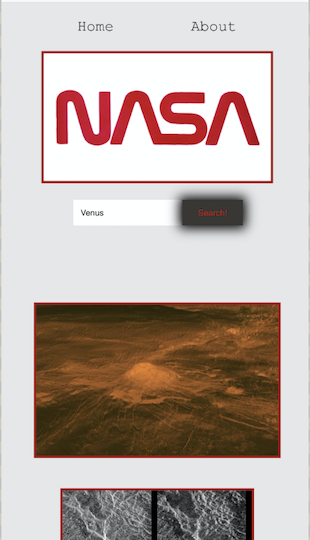

## Nasa Pictures Search

Part of my course at Manchester Codes I have been asked to build a React web application that allows users to search for images based on a query relating to space. I was using the NASA API endpoint to complete the task.
`image search:
GET​​ ​​https://images-api.nasa.gov/search ​Params: ​​q`

### How it looks like on Computer

### How it looks like on Phone
{:height="50%" width="50%"}

### Built with
React

### Testing with
+ [Jest](https://www.npmjs.com/package/jest)
+ [React Testing Library](https://testing-library.com/docs/dom-testing-library/intro)

### Used Packages
+ [Axios](https://www.npmjs.com/package/axios)
+ [PropTypes](https://www.npmjs.com/package/prop-types)

### Run the App
Clone Repository 
`git clone https://github.com/szabinakov/tech-test.git`
Move to the directory and install npm
`npm init`
Run the app on your localhost
`npm start`

#### Author
Szabina Kovacs

### The deployed version you can check out: [here](https://tech-test.vercel.app/)

